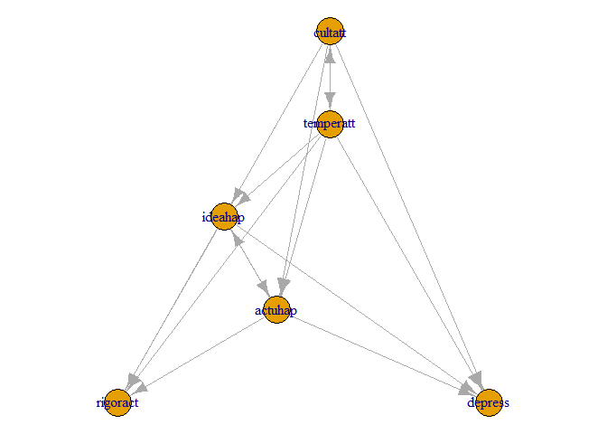
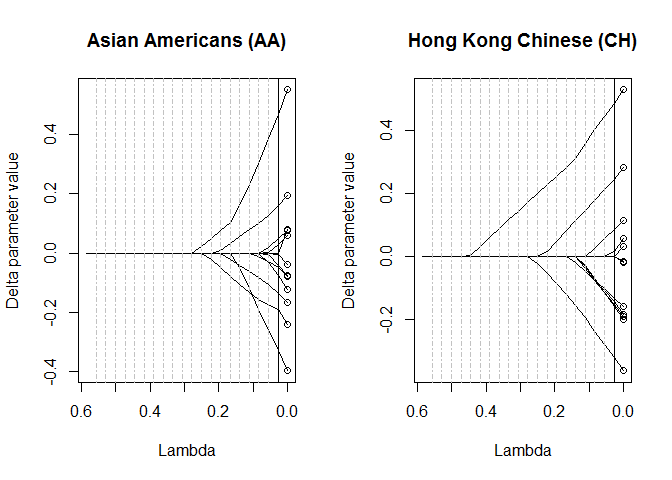

<!-- README.md is generated from README.Rmd. Please edit that file -->
Introduction
------------

This repository contains the R scripts and data used in the paper *Model selection with lasso in multi-group structural equation models* by JC Lindstrøm and FA Dahl, which has been submitted for publication.

This repository is not a proper R package, and the scripts and functions hosted here are intended to serve as a proof of the concept raher than a full-fledged analysis tool. The model specification is not particularly user friendly and the functionality is limited compared to other other SEM packages.

The file sem\_ram\_func.R contains the functions needed to fit a lasso-penalized multi-group structural equation model, as described in detail in the above mentioned paper. The other scripts contains the analyses described in the paper.

The scripts depend on the igraph, Matrix and dplyr packages.

Model specification and estimation
----------------------------------

Models are specified by creating an igraph-object. A simple way to do this is to create a data.frame that contains the relationships you want to model. Below is how to specify the Affect Value Theory (AVT) model. See [this archived link](https://web.archive.org/web/20170707112552/http://web.stanford.edu/class/psych253/section/section_8/section8.html#question-c-group-comparisons) for some more details. First a data.frame of the asymmetric relationships (*ie.* the regression coefficients) are specified. Next are the asymmetric relationships (covariances) specified. These are then used to create the igraph object.

Residual variances does not need to be specified.

``` r

require(igraph)
require(Matrix)
require(dplyr)

source('R\\sem_ram_func.R')

# Assymetric relations.
graph_df_avt_asym <- data.frame(from = c('cultatt', 'temperatt','cultatt', 'temperatt', 'ideahap', 'actuhap', 'cultatt', 'temperatt', 'ideahap', 'actuhap', 'cultatt', 'temperatt'),
                    to = c('ideahap', 'ideahap', 'actuhap', 'actuhap', 'rigoract', 'rigoract', 'rigoract', 'rigoract', 'depress', 'depress', 'depress', 'depress'))

# covariances. Notice how they are specified as two mirrored directed relationships.
graph_df_avt_sym <- data.frame(from = c('ideahap', 'actuhap', 'cultatt', 'temperatt'),
                    to = c('actuhap', 'ideahap', 'temperatt', 'cultatt'))

# combine the symmetric and asymmetric data.frames.
graph_df_avt <- rbind(graph_df_avt_asym, graph_df_avt_sym)

# Create igraph object.
model_igraph_avt <- graph_from_data_frame(graph_df_avt)
```

It is usually a good idea to plot the graph:

``` r
# The sugiyama layout algorithm usually provides good results.
model_plot_layout <- layout_with_sugiyama(model_igraph_avt)
plot(model_igraph_avt, layout = model_plot_layout$layout)
```



The next step is to use the igraph object to create the RAM model matrices that is used later on when the parameters are estimated. The make\_ram\_matrices function does this.

If your model contains latent variables, they need to be specified at this step. This is done by giving a character vector of the variables names that should be latent to the *latent\_variables* argument. To ensure identification is one of the coefficients for the observed variables emerging from each latent variable fixed to 1.

``` r
ram_matrices_avt <- make_ram_matrices(model_igraph_avt)

# If, for example, the cultatt and temperatt variables were 
# unobserved, this should be specified like this:
# ram_matrices_avt <- make_ram_matrices(model_igraph_avt, latent_variables = c('cultatt', 'temperatt'))
```

Now it is time to estimate the parameters of the model based on some data. The function *estimate\_ram\_group* estimates the model without any penalization. The parameter estimates should therefore match those of other SEM software packages.

The function require the output from the *make\_ram\_matrices* function, a data.frame with columns that match the variable names specified in the model, and which variable that divides the data in groups.

You can also specify whether the parameters should be estimated using the difference parameterization. By default this is **FALSE**, but if **TRUE**, the first group is arbitrarily selected as the reference group.

``` r

# Load the Affect Valuation Theory data.
dta <- read.csv("data\\jt-data1.csv")

# Fit the model.
avt_est <- estimate_ram_group(ram_matrices = ram_matrices_avt, # Model specification.
                             inndata = dta, # data.frame
                             group_var = 'group', # Grouping variable
                             difference_param = FALSE) # Shoud the difference parameterization should be used?
```

The RAM matrices with the estimated parameters can be found in the *ram\_matrices\_est* slot.

``` r
# Group 1: European Americans (EA)
avt_est$ram_matrices_est[[1]][['A']]
avt_est$ram_matrices_est[[1]][['M']]
avt_est$ram_matrices_est[[1]][['S']]

# Group 2: Asian Americans (AA)
avt_est$ram_matrices_est[[2]][['A']]
avt_est$ram_matrices_est[[2]][['M']]
avt_est$ram_matrices_est[[2]][['S']]

# Group 3: Hong Kong Chinese (CH)
avt_est$res_params[[1]]
avt_est$ram_matrices_est[[3]][['A']]
avt_est$ram_matrices_est[[3]][['M']]
avt_est$ram_matrices_est[[3]][['S']]
```

### Penalized estimation

To estimate the model using the lasso penalization together with the difference paramterization you use the *estimate\_ram\_group\_lasso* function. By default the function find 10 reasonable values of lambda to use, but here we specify that 20 values should be used instead. It is also possible to supply your own specific values of lambda via the *lambda\_values* argument.

``` r
# Scale and center the data.
dta %>%  group_by(group) %>% 
    mutate_all(funs(. - mean(.))) %>% 
    mutate_all(funs(. / sd(.))) %>% 
    ungroup() -> dta_scaled 

# Fit model using lasso
est_lasso_avt <- estimate_ram_group_lasso(ram_matrices = ram_matrices_avt,
                                    inndata = dta_scaled,
                                    group_var = 'group',
                                    n_lambdas = 20)
```

The values of lambda that was used can be found in the *lambdas* slot.

``` r
est_lasso_avt$lambdas
#>  [1] 0.55604120 0.52823914 0.50043708 0.47263502 0.44483296 0.41703090
#>  [7] 0.38922884 0.36142678 0.33362472 0.30582266 0.27802060 0.25021854
#> [13] 0.22241648 0.19461442 0.16681236 0.13901030 0.11120824 0.08340618
#> [19] 0.05560412 0.02780206
```

You can plot the evolution of the parameter estimates across the range of lambda using the *plot\_lasso\_trace* function.

``` r
par(mfrow=c(1,2))
plot_lasso_trace(est_lasso_avt, grp = 2, main='Asian Americans (AA)')
plot_lasso_trace(est_lasso_avt, grp = 3, main='Hong Kong Chinese (CH)')
```



The ram matrices with the estimated parameters can be extracted using the *get\_estimated\_ram\_matrices* function. The function returns a list where each element correspond to a value of lambda.

``` r
get_estimated_ram_matrices(est_lasso_avt)
```

More user friendly perhaps, is the *get\_nice\_par\_table* function, which returns a data.frame with the (asymmetric only) parameter estimates for a given lambda and a given group.

``` r
get_nice_par_table(est_lasso_avt, which_lambda=1, which_group=1)
```

### Cross validation

We can use cross validation to tune lambda. The *cv\_ram\_group\_lasso* function implements the cross validation procedure as decribed in the paper.

``` r

# We recomend using seeds to make the results reproducible. 
cv_seed <- 3803881
set.seed(cv_seed)

cv_res_avt <- cv_ram_group_lasso(ram_matrices = ram_matrices_avt,
                                                    inndata = dta_scaled,
                                                    group_var = 'group',
                                                    n_cvs=5, # The number of repeated CV rounds
                                                    n_lambdas_cv=20) # The number of lambda values to use.
```

We can plot the out-of-sample errors as a function of lambda for both groups:

``` r
# Average the out-of-sample error across all five CV replications.
avg_grp_cv_error <- apply(cv_res_avt$lambda_fits_cv, MARGIN = c(1, 2), mean)

par(mfrow=c(1,2))
plot(cv_res_avt$lambdas_cv, avg_grp_cv_error[,2], type='b', main = 'Asian Americans (AA)')
plot(cv_res_avt$lambdas_cv, avg_grp_cv_error[,3], type='b', main = 'Hong Kong Chinese (CH)')
```


We can get the lambda values that give the least out-of-sample error. This happen to be the same for both groups.

``` r
best_lambda_grp2 <- cv_res_avt$lambdas_cv[which.min(avg_grp_cv_error[,2])]
best_lambda_grp3 <- cv_res_avt$lambdas_cv[which.min(avg_grp_cv_error[,3])]

print(c(best_lambda_grp2, best_lambda_grp3))
#> [1] 0.1734188 0.1734188
```

Finally we can fit the model on the complete data set, using the optimal lambdas.

``` r

best_lambdas <- unique(c(best_lambda_grp2, best_lambda_grp3))

est_lasso_avt_best_lambda <- estimate_ram_group_lasso(ram_matrices = ram_matrices_avt,
                                                            data = dta_scaled,
                                                            group_var = 'group',
                                                            lambda_values = best_lambdas)
```

We can use the function *get\_nice\_par\_table* to present the parameter estimates (the regression coefficients only) in a nice table. Here are the estimated parameters from the third group (Hong Kong Chinese):.

``` r
get_nice_par_table(est_lasso_avt_best_lambda, which_group = 3)
#>    Response Predictor    Estimate
#> 1   ideahap   cultatt  0.00000000
#> 2   actuhap   cultatt  0.07362173
#> 3  rigoract   cultatt  0.00000000
#> 4   depress   cultatt  0.00000000
#> 5   ideahap temperatt  0.00000000
#> 6   actuhap temperatt -0.10881352
#> 7  rigoract temperatt  0.00000000
#> 8   depress temperatt  0.00000000
#> 9  rigoract   ideahap  0.00000000
#> 10  depress   ideahap  0.00000000
#> 11 rigoract   actuhap  0.27686458
#> 12  depress   actuhap  0.00000000
```

Data sets
---------

The Affect Value Theory (Tsai *et al.* 2016) data set was originaly downloaded from the web site of Stanford University, but has since been removed. See [this archived link](https://web.archive.org/web/20170707112552/http://web.stanford.edu/class/psych253/section/section_8/section8.html#question-c-group-comparisons) for some more details about the data set and the model used in the paper.

The data from the 2013 Norwegian election survey was downloaded from the web pages of the Norwegian Centre For Research Data ([Link](http://www.nsd.uib.no/nsddata/serier/norske_valgundersokelser_eng.html)).

The functions of sem\_ram\_func.R
---------------------------------

There are some additional functions in the sem\_ram\_func.R script that isn't covered in the above tutorial. Here is a quick summary.

-   **tidy\_lasso\_trace(lasso\_res, grp=2)** - A tidy alternative to the *plot\_lasso\_trace* function. Returns a data.frame of the paramter evolution across lambda. Useful when creating plots with ggplot2. Take a look in the analysis scripts for examples of how it can be used.

-   **ram\_data\_fit(fitted\_model, new\_data, lambda\_idx=0, groupwise=FALSE)** - For a estimated model, how well does this fit a new data set? This function can take both a regular model fit or a lasso fit.
    -   lambda\_idx: In the case of a lasso fit, this should be an integer specifying which lambda value to use.
    -   groupwise: If TRUE, return the fit of each group seperately.

Functions used in fitting the model:

-   **obj\_func\_group\_ccd** - The objective function (the log likelihood) to be used with *optim*.

-   **obj\_grad** - The gradient of objective function (the log likelihood) for a single group, using the formulas from von Oertzen & Brick (2014).

-   **obj\_grad\_grp\_ccd** - The gradient of objective function (the log likelihood) to be used with *optim*. Relies on the *obj\_grad* function.

Some minor utility functions:

-   **diag\_idx(M)** - Get the index for the diagonal of a matrix.

-   **symop(M)** - The "symmetric opperation" M \* M^T defined in the gradient paper (von Oertzen & Brick, 2014). Used in computing the gradients.

-   **tr(M)** - The matrix trace.

-   **soft\_treshold(xx, lambda=0)** - The soft tresholding function used in the cyclic coordinate descent algorithm.

References
----------

-   Tsai JL, Knutson B, Fung HH. *Cultural variation in affect valuation.* J Pers Soc Psychol. 2006 Feb;90(2):288-307.

-   *Valgundersøkelsen 2013 - Dokumentasjons- og tabellrapport \[Internet\].* ssb.no. \[cited 2017 Nov 21\]. Available from: <http://www.ssb.no/valg/artikler-og-publikasjoner/valgundersokelsen-2013>

-   von Oertzen T, Brick TR. *Efficient Hessian computation using sparse matrix derivatives in RAM notation*. Behav Res Methods. 2014 Jun;46(2):385-95
